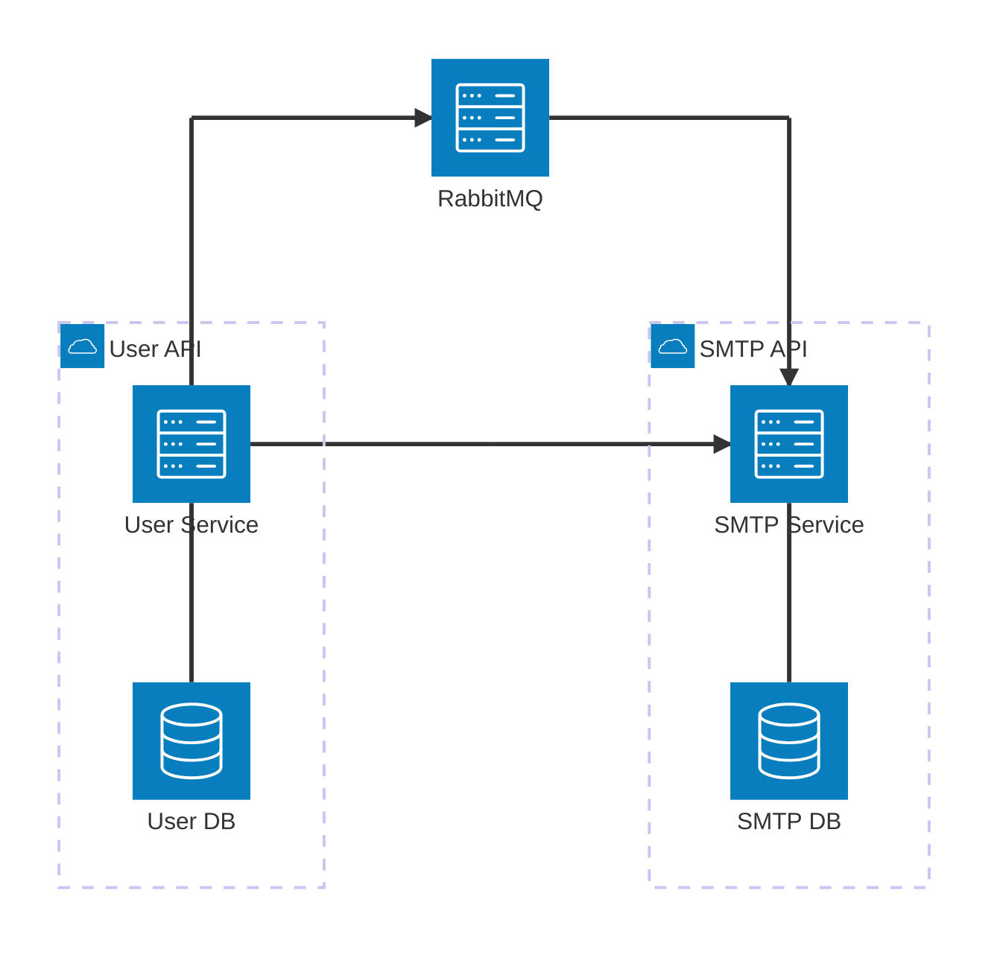

# Go Microservices Architecture Lab

An event-driven Go microservices system designed as an architectural comparison lab.

This repository intentionally implements two different architectural styles within the same distributed system:

- **User Service** - [Clean Architecture](https://github.com/evrone/go-clean-template)
- **SMTP Service** - Minimalist Domain-Oriented Architecture

The goal is to compare structure, complexity, maintainability, and idiomatic Go practices in real-world microservice scenarios.

## Project Goals

This lab explores:

- Clean Architecture in Go
- Minimalist idiomatic Go service design
- Event-driven microservices (RabbitMQ)
- Domain-driven design principles
- SMTP uniqueness coordination across services
- Audit logging and asynchronous processing
- Monorepo structure with multiple Go modules
- CI automation with GitHub Actions

## System Architecture

## Services Overview

### User Service (Clean Architecture)

#### Responsibilities

1. **User CRUD Operations**
    
   User fields:
   - FirstName
   - LastName
   - FullName
   - CountryCode
   - Department

1. **SMTP Generation Logic**

   - On **Create / Update**:
      - Generate PrimarySMTP
      - Validate uniqueness:
        - Local storage
        - Remote SMTP service
      - If taken → append numeric suffix

   - On **Update**:
      - If SMTP exists in user's secondary list - swap
      - If Primary changed - move old Primary to Secondaries

#### Event Publishing

On every user operation:
- Publish event to RabbitMQ:
  - `UserCreated`
  - `UserUpdated`
  - `UserDeleted`

#### Audit Logging

On every user modification:
- Generate human-readable audit message
- Include what changed
- Include who made the change
- Process asynchronously using channel

### SMTP Service (Minimalist Architecture)

#### Responsibilities

- HTTP endpoint to validate SMTP availability
- Subscribe to User events
- Maintain SMTP registry
- Update storage accordingly

## Learning Outcomes

This repository exists to:
* Understand trade-offs between architecture styles
* Compare boilerplate vs simplicity
* Analyze maintainability
* Explore distributed system edge cases
* Practice concurrency and event-driven design