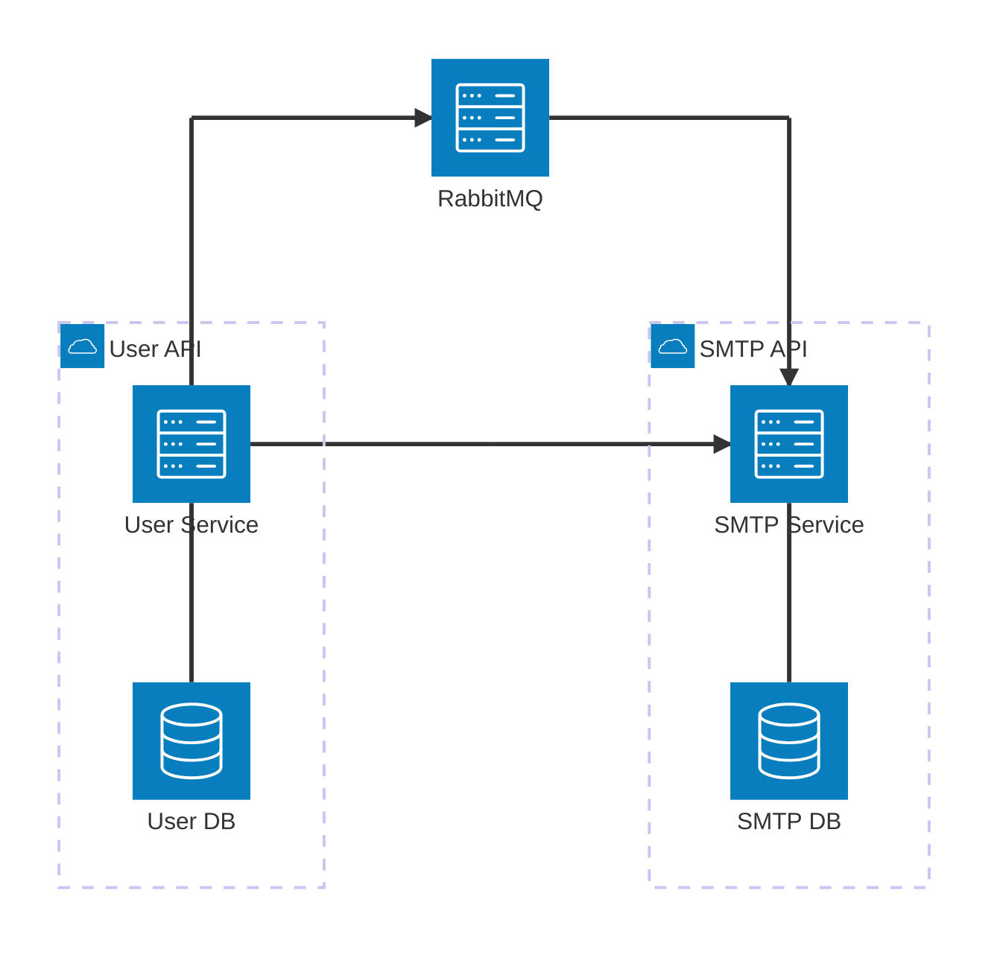

# Go Microservices Architecture Lab

An event-driven Go microservices system built as a structured architectural comparison lab. It intentionally implements two different architectural styles within the same distributed system and demonstrates how AI review agents can be integrated into a production-style engineering workflow.

- **User Service** - [Clean Architecture](https://github.com/evrone/go-clean-template)
- **SMTP Service** - Minimalist Domain-Oriented Architecture

## Goals

- Compare Clean Architecture vs. minimalist idiomatic Go across real microservice scenarios
- Explore distributed system trade-offs: event-driven design, SMTP uniqueness coordination, audit logging
- Practice concurrency, domain-driven design, and monorepo structure with multiple Go modules
- Demonstrate disciplined ADR-driven development and AI-augmented code review in a CI workflow

## System Architecture

## Services Overview

### User Service (Clean Architecture)

#### Responsibilities

1. **User CRUD Operations**
    
   User fields:
   - FirstName
   - LastName
   - FullName
   - CountryCode
   - Department

1. **SMTP Generation Logic**

   - On **Create / Update**:
      - Generate PrimarySMTP
      - Validate uniqueness:
        - Local storage
        - Remote SMTP service
      - If taken → append numeric suffix

   - On **Update**:
      - If SMTP exists in user's secondary list - swap
      - If Primary changed - move old Primary to Secondaries

#### Event Publishing

On every user operation:
- Publish event to RabbitMQ:
  - `UserCreated`
  - `UserUpdated`
  - `UserDeleted`

#### Audit Logging

On every user modification:
- Generate human-readable audit message
- Include what changed
- Include who made the change
- Process asynchronously using channel

### SMTP Service (Minimalist Architecture)

#### Responsibilities

- HTTP endpoint to validate SMTP availability
- Subscribe to User events
- Maintain SMTP registry
- Update storage accordingly

## Engineering Practices

[Architectural decisions](docs/ADRs.md) (ADRs) and per-service design decisions (DDRs) are recorded and versioned. Pull requests that contradict a recorded decision must reference it explicitly or introduce a new one.

All pull requests are reviewed by a configured [GitHub Copilot review agent](.github/copilot-review-instructions.md) acting as a Senior Go Engineer. It flags production bugs, concurrency safety issues, resource leaks, error handling violations, and non-idiomatic Go patterns. It does not redesign architecture or suggest speculative refactors.

AI is treated as a reviewer assistant and an enforcement layer — not an architect or decision-maker. Domain logic, service boundaries, and architectural decisions remain human-owned.