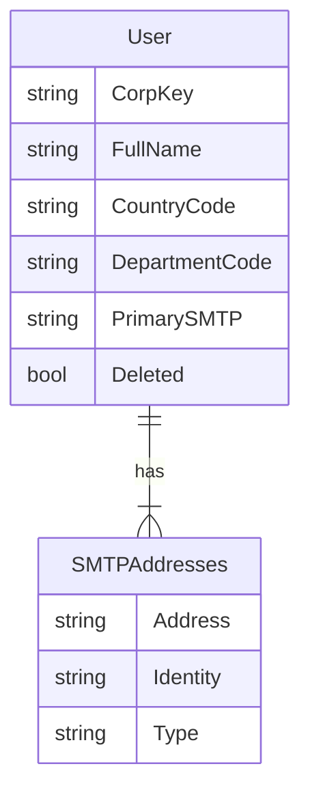

# ERD

## Description

User Service stores user profile data and assigns SMTP addresses based on firstName, lastName, countryCode, and departmentCode. SMTP Service is the global source of truth for all SMTP addresses across the organization (including users, shared mailboxes, distribution lists, etc.).

**Ownership & Validation:**
- User Service: Authoritative for user-to-SMTP mapping, enforces local uniqueness via database constraints
- SMTP Service: Authoritative for global SMTP existence, validates asynchronously via events
- User Service **guarantees** that assigned Primary and Secondary SMTP addresses are unique globally

### Data Model

**User Table**
- Stores user profile data: corpKey (PK), fullName, countryCode, departmentCode
- Does NOT store firstName/lastName (used only as SMTP generation inputs)
- Denormalizes `PrimarySMTP` for read performance (avoids join on every GET)
- Soft delete via `Deleted` boolean flag

**SMTPAddresses Table**
- Validation-only snapshot of all locally assigned SMTP addresses
- Historical record (append-only): tracks all SMTPs ever assigned to each user
- Enforces global uniqueness via unique constraint on `Address` column
- **Type** field: `Primary` | `Secondary`
- Not synchronized with SMTP Service (eventual consistency)

**SMTP Generation:**
- Pattern: `{firstName}.{lastName}[.suffix]@{domain}`
- Domain derived from countryCode + departmentCode via lookup table
- Suffix iteration (`.1`, `.2`, ...) scoped per domain
- firstName/lastName determine local-part, countryCode/departmentCode determine domain

## SMTP Address Lifecycle

**Assignment**
- Pattern: `{firstName}.{lastName}[.suffix]@{domain}`
- Domain derived from countryCode + departmentCode via lookup table
  - Default: `co-group.com`
  - Examples: `NL/1234 → co.nl`, `BE/* → co.be`
- Local-part uniqueness checked within target domain only
- Numeric suffix iteration (`.1`, `.2`, `.3`...) scoped per domain
- Examples:
  - `john.doe@co.nl` exists → new user in NL/1234 gets `john.doe.1@co.nl`
  - `john.doe@co.nl` exists → new user in BE domain gets `john.doe@co.be` (no suffix)
- Never reassigned globally—once claimed in any domain, permanently tied to that corpKey
- Unique constraint on `SMTPAddresses.Address` enforces global uniqueness across all domains

**Soft Delete**
- User deletion sets `User.Deleted = true`
- SMTP addresses remain in `SMTPAddresses` table (tombstoned indefinitely)
- Deleted users' SMTPs are never released for reuse (globally across all domains)
- Next user with same firstName/lastName in same domain gets numeric suffix
  - Example: `john.doe@co.nl` deleted → new user in NL/1234 gets `john.doe.1@co.nl`
- Next user with same firstName/lastName in different domain may not need suffix
  - Example: `john.doe@co.nl` deleted → new user in BE domain gets `john.doe@co.be`
- Queries filter via `WHERE User.Deleted = false` to exclude deleted users from responses

**Secondary Addresses**
- Accumulated when primary SMTP changes (old primary → secondary)
- Append-only—never removed
- Historical record of all SMTPs ever assigned to this user
- Unsorted in GET responses
- Growth unbounded over user lifetime

**SMTP Swap Logic (on Update)**
- Regeneration triggered if firstName/lastName change (local-part) OR countryCode/departmentCode change (domain)
- Same-domain updates: Swap logic applies if regenerated address exists in user's secondaries
- Cross-domain updates: Always generate new, old primary → secondaries
- If regenerated primary already exists in user's `secondarySMTPs` (same domain only):
  1. Promote that address from secondaries to primary
  2. Demote current primary to secondaries
  3. No new SMTP allocated—addresses swap positions
- If regenerated primary is unique:
  1. Old primary moved to `secondarySMTPs`
  2. New primary assigned following suffix iteration rules

## Diagram

